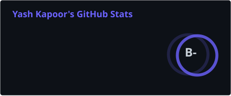
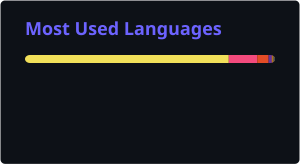

<div align="center">


<!-- Dynamic Typing SVG -->

[](https://git.io/typing-svg)

<p>
  <a href="https://www.linkedin.com/in/yash-kapoor-a17026251/"></a>
  <a href="mailto:yash.kpr2708@gmail.com"></a>
  <a href="https://github.com/acemaster27"></a>
  <a href="https://leetcode.com/u/acemaster27/"></a>
</p>


</div>

---

## 🧑‍💻 About Me

```js
const yash = {
  pronouns: "he" | "him",
  location: "Ranchi, Jharkhand 🇮🇳",
  education: "B.Tech CSE (DS & AI) @ IIIT Ranchi | CGPA: 8.94",
  currentFocus: "Microservices Architecture & GenAI/RAG Pipelines",
  techStack: ["Node.js", "Docker", "Kubernetes", "LangChain", "Redis"],
  funFact:
    "I've solved 400+ DSA problems and I'm a 3-Star Coder on CodeChef! ⭐⭐⭐",
};
```

- 🔭 Currently building **scalable backend systems** with Node.js, Docker & Kubernetes
- 🤖 Exploring **Generative AI**, **LangChain**, and **RAG pipelines**
- 🌱 Deep-diving into **distributed systems**, **event-driven architectures**, and **stream processing**
- 💬 Ask me about **REST APIs, Microservices, Producer-Consumer Queues, Docker, Kubernetes, GenAI**
- ⚡ I love turning complex backend problems into elegant, containerized solutions

---

## ⚡ What I'm Up To

- 🔨 Building **MiniLog Intelligence** — real-time log analysis with microservices
- 🤖 Experimenting with **LangChain + RAG** for intelligent document processing
- 📚 Learning **System Design** & **Distributed Consensus Algorithms**
- 🎯 2025 Goals: Contribute to Open Source & hit 500+ DSA problems

---

## 🛠️ Tech Stack

<div align="center">

### Languages

[](https://skillicons.dev)

### Frameworks & Libraries

[](https://skillicons.dev)


### AI / GenAI


### Databases & Caching

[](https://skillicons.dev)

### DevOps & Tools

[](https://skillicons.dev)

</div>

---

## 🚀 Featured Projects

<div align="center">
<table>
<tr>
<td width="50%">

### 🔍 [MiniLog Intelligence](https://github.com/acemaster27/MiniLog)

**Real-Time Log Analysis Platform**

A microservices-based log analysis platform with 3 independently deployable services communicating via Redis. Features a memory-efficient streaming pipeline using BullMQ and real-time analytics dashboard with Socket.IO.

`Node.js` `Express` `Redis` `PostgreSQL` `Socket.IO` `Docker` `Kubernetes`

</td>
<td width="50%">

### ✈️ [Airline Booking System](https://github.com/acemaster27/AirTicketBookingService)

**Microservices Flight Booking Backend**

A distributed airline booking system built with microservices architecture featuring dedicated services for flight search, authentication, and ticket booking with inter-service communication.

`Node.js` `Express` `MySQL` `Sequelize` `RabbitMQ`

</td>
</tr>
<tr>
<td width="50%">

### 📝 [Blogify](https://github.com/acemaster27/CodeClause_Blog_Platform)

**Full-Stack Web Blogging Platform**

A MERN stack blogging platform with 10+ RESTful API endpoints, JWT-based authentication with bcrypt password hashing, and role-based access control.

`React` `Node.js` `Express` `MongoDB` `JWT`

</td>
<td width="50%">

### 🌤️ [Weather App](https://github.com/acemaster27/React_Weather_App)

**Real-Time Weather Dashboard**

A responsive React weather application with real-time weather data fetching, beautiful UI, and location-based forecasting.

`React` `JavaScript` `CSS` `Weather API`

</td>
</tr>
</table>
</div>

---

## 📊 GitHub Stats

<div align="center">






</div>

---

## 🐍 Contribution Snake

<div align="center">

<picture>
  <source media="(prefers-color-scheme: dark)" srcset="https://raw.githubusercontent.com/acemaster27/acemaster27/output/github-snake-dark.svg" />
  <source media="(prefers-color-scheme: light)" srcset="https://raw.githubusercontent.com/acemaster27/acemaster27/output/github-snake.svg" />
  
</picture>

</div>

---

## 🤝 Connect With Me

<div align="center">

<a href="https://www.linkedin.com/in/yash-kapoor-a17026251/"></a>
<a href="mailto:yash.kpr2708@gmail.com"></a>
<a href="https://leetcode.com/u/acemaster27/"></a>

</div>

---

<div align="center">

[](https://github.com/piyushsuthar/github-readme-quotes)


</div>
